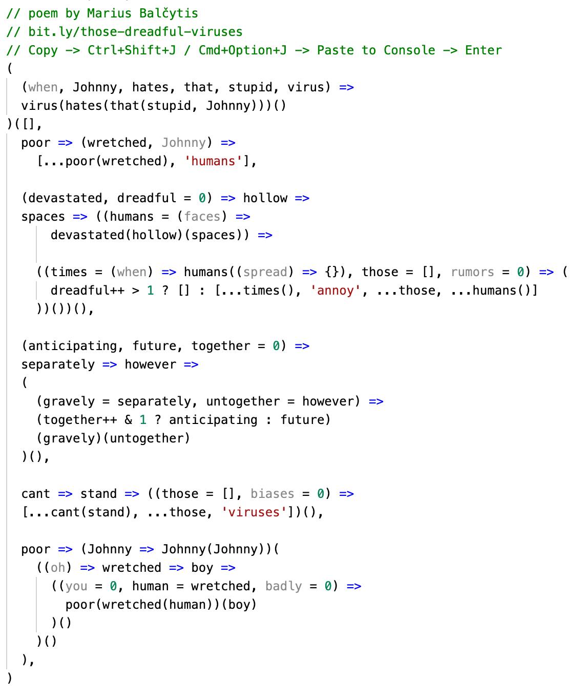

# Those dreadful viruses

This is a poem written as a submission for the [Source Code Poetry](http://sourcecodepoetry.com/) competition.

## The poem

Also see [raw](poem.js) for testing it out.

## Other submissions

If you lack motivation for better things to do, see [my other submissions](https://github.com/search?q=user%3Amariusbalcytis+poem) to remember those cheerful times when poems were not as hollow as this one.
